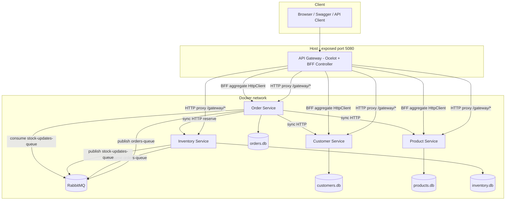

# Second Deliverable — Extension of Containerized E-Commerce Microservices Backend

**Course:** Programming for the Internet  
**Title:** Containerized e-commerce microservices extension (API Gateway, RabbitMQ, DTOs)  
**Submission:** GitHub repository + PDF report (export this Markdown to PDF)  
**Date:** April 2026  

**Student Name / ID:** _(fill in)_

---

## 1. Introduction

### 1.1 Overview of the System

This project extends the midterm work into a **containerized** set of e-commerce-related microservices: **Product**, **Customer**, and **Order** as core services, plus a fourth service **Inventory**. Each service uses its **own SQLite database** (database-per-service), persists data with **Entity Framework Core**, and exposes a REST API.

**Docker Compose** orchestrates four business services, **RabbitMQ** (async messaging), and the **API Gateway** (single entry). Clients use the gateway at `http://localhost:5080` (host port mapped to container 8080). Microservices are **not** published on the host in Compose, matching the requirement that internal services are not directly exposed.

### 1.2 Summary of Improvements from Midterm

| Area | Change |
|------|--------|
| Architecture | **API Gateway** (Ocelot) for unified routing and public entry |
| Communication | **RabbitMQ** for order and stock events; multiple publishers and consumers |
| Contracts | **DTOs** for API request/response models instead of exposing entities |
| Domain | Fourth service **Inventory**; Order calls Inventory to reserve stock synchronously and publishes async events |
| Gateway | **BFF-style aggregation**: one request returns order + customer + product |
| Deployment | `docker-compose.yml` includes all services, RabbitMQ, and gateway; `docker compose up --build` |

### 1.3 Architecture Diagram

The diagram below shows services, gateway, per-service databases, and RabbitMQ (sync HTTP and async messaging).

**Note:** `/gateway/...` forwarding is handled by **Ocelot**. `GET /api/gateway/order/{id}` is implemented in **GatewayController**, which calls downstream HTTP APIs directly and is **not** defined in the Ocelot route table.

---

## 2. API Gateway Design

### 2.1 Routing Explanation

The gateway uses **ASP.NET Core + Ocelot**; routes are in `ocelot.json`. **Upstream** paths use the `/gateway` prefix; **downstream** targets are service containers at `http://{service}:8080` on the Docker network.

| Upstream example | Downstream (example) | Target |
|------------------|----------------------|--------|
| `GET/POST /gateway/orders` | `/api/orders` | Order Service |
| `/gateway/orders/{...}` | `/api/orders/{...}` | Order Service |
| `POST /gateway/customers` | `/api/customers` | Customer Service |
| `/gateway/customers/{...}` | `/api/customers/{...}` | Customer Service |
| `GET/POST /gateway/products` | `/api/products` | Product Service |
| `/gateway/products/{...}` | `/api/products/{...}` | Product Service |
| `/gateway/inventory/{...}` | `/api/inventory/{...}` | Inventory Service |

Ocelot uses **Polly** for resilience to transient downstream failures. A custom **document filter** adds Ocelot routes to Swagger (they are not controller actions, so Swashbuckle would not list them otherwise).

**Exposure:** Only **apigateway** maps `5080:8080` in `docker-compose.yml`; other services have no host ports.

### 2.2 Aggregation Logic

The assignment requires at least one **aggregated** endpoint. This project implements a **BFF** aggregate:

- **Path:** `GET /api/gateway/order/{orderId}`
- **Type:** `GatewayController`
- **Steps:**
  1. Call `GET api/orders/{orderId}` via the `orders` `HttpClient`.
  2. Return 404 if the order is missing; propagate status and body on other errors.
  3. Read `CustomerId` and `ProductId` from the order JSON.
  4. **In parallel**, call `GET api/customers/{CustomerId}` and `GET api/products/{ProductId}` (`Task.WhenAll`).
  5. Return `{ order, customer, product }`; `customer` / `product` may be null if downstream calls fail.

This lives **alongside** Ocelot: Ocelot proxies single-service calls; the controller merges multiple service responses.

---

## 3. Messaging Design

### 3.1 Events Used

Besides **OrderCreated**, the system uses (JSON payloads include `eventType`):

| Event | Meaning | Typical fields |
|-------|---------|----------------|
| **OrderCreated** | Order persisted | `orderId`, `customerId`, `productId`, `quantity`, `total`, … |
| **OrderCancelled** | Status set to cancelled | `orderId` |
| **StockUpdated** | Stock changed (create/update, reserve, release, …) | `productId`, `newStock`, `reason` |

Queues use the **default exchange** with **routing key = queue name**:

- `orders-queue` — order-related events  
- `stock-updates-queue` — stock updates  

### 3.2 Producers and Consumers

| Component | Role | Queue | Behavior |
|-----------|------|-------|----------|
| **Order Service** | Producer | `orders-queue` | Publishes `OrderCreated` on create; `OrderCancelled` when status becomes `Cancelled` |
| **Inventory Service** | Consumer | `orders-queue` | Parses `eventType`, logs `OrderCreated` / `OrderCancelled`, **Ack** |
| **Inventory Service** | Producer | `stock-updates-queue` | Publishes `StockUpdated` on stock changes |
| **Order Service** | Consumer | `stock-updates-queue` | Logs messages, **Ack** |

**Reaction to events:** The assignment mentions logging and stock updates. Here, **synchronous** checkout already **reserves** stock via HTTP; async consumers **log and acknowledge**, satisfying producer/consumer and extra-event requirements while leaving room to add automatic release on cancel later.

**Startup:** Order and Inventory `depends_on` RabbitMQ **healthcheck**; consumers **retry** connections if the broker is slow to start.

---

## 4. DTO Design

### 4.1 Purpose and Benefits

- **Decouple API from persistence:** Controllers use DTOs; entities stay inside EF and domain code.
- **Stable contracts:** Entities can evolve; mapping controls the public shape.
- **Clear service boundaries:** Order’s HTTP clients consume JSON aligned with each service’s DTOs.

### 4.2 Example Mappings

**Customer Service** — `CreateCustomerRequest` → new `Customer` → `CustomerResponse`.

**Product Service** — `CreateProductRequest` / `UpdateProductRequest` → `Product` → `ProductResponse`.

**Order Service** — `CreateOrderRequest` → validate customer, price, inventory → `Order` → `OrderResponse` (includes `UnitPrice`, `DiscountPercent`, `Total`, `Status`). `UpdateOrderStatusRequest` → update `Order.Status` → `OrderResponse`.

**Inventory Service** — `ReserveStockRequest` → update `InventoryItem.Stock` → `InventoryItemResponse` or `StockChangeResponse`.

Mapping is done in private helpers such as `ToResponse` or projections in controllers.

---

## 5. Challenges & Solutions

1. **SQLite path vs Docker volume**  
   - **Issue:** `Data` is mounted at `/app/Data`, but `Development` used relative `products.db`, which resolved to `/app/products.db` inside the container—not the mounted folder—so host `Data/*.db` and container data diverged.  
   - **Fix:** When `DOTNET_RUNNING_IN_CONTAINER=true`, use `Data Source=/app/Data/*.db`, or set `ASPNETCORE_ENVIRONMENT` appropriately in Compose.

2. **`EnsureCreated` vs schema changes**  
   - **Issue:** Model gained `DiscountPercent` while an old `orders.db` had no column → `no such column`.  
   - **Fix:** Use **`Database.Migrate()`** on startup; if an old EnsureCreated DB conflicts with migration history, **delete** `orders.db` once and let migrations recreate it.

3. **Ocelot routes missing from Swagger**  
   - **Issue:** Forwarded routes have no controller actions.  
   - **Fix:** **`IDocumentFilter`** registers `/gateway/...` operations and includes `responses` for Swagger UI.

4. **RabbitMQ startup order**  
   - **Issue:** `docker compose start` may not wait for healthchecks.  
   - **Fix:** Prefer `docker compose up -d` with `depends_on` + `service_healthy`; keep consumer connection retries.

---

## 6. Conclusion

The deliverable keeps four services (Product, Customer, Order, Inventory), database-per-service, and EF Core, and adds **Ocelot gateway routing**, **RabbitMQ** with multiple events, **DTOs** across APIs, and a **BFF aggregate** for order + customer + product. The stack runs with **`docker compose up --build`** with the gateway as the only public entry, matching the assignment goals.

You may redraw the architecture in **draw.io / Visio** for the final PDF and export this document to **PDF** for submission alongside the GitHub repository.

---

## References (optional)

- Course materials: Lecture 8 (RabbitMQ), Lecture 9 (API Gateway / BFF).  
- Ocelot: https://github.com/ThreeMammals/Ocelot  
- RabbitMQ: https://www.rabbitmq.com/documentation.html  
